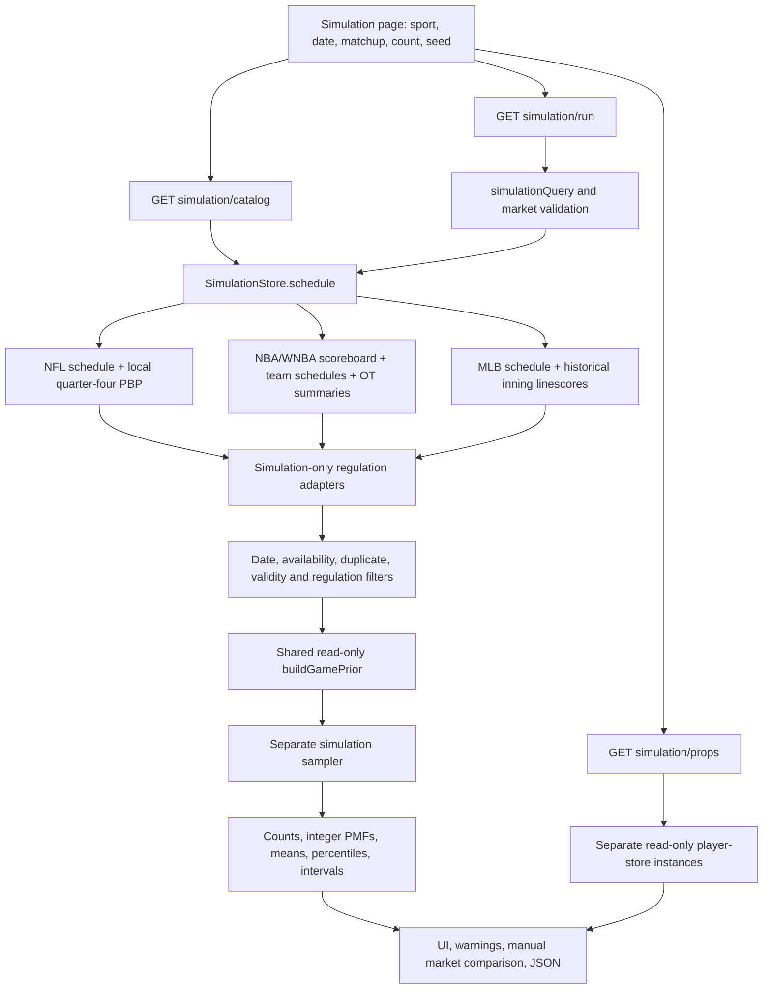

# Final deep audit: game simulation

Audited September 22–23, 2026, against the current working tree, actual stored source bytes, executable tests and local browser. This report supersedes the earlier simulation reports as the current explanation. Engine `pregame-score-simulation-v3`; shared prior `live-game-distribution-v1`; RNG namespace `pregame-score-simulation-v1`. No parameters were fitted or tuned during this audit.

## 1. Plain-language conclusion

The app repeatedly generates two team scores using earlier regulation scores to estimate team strength. Recent games matter more. Small or old samples are pulled toward a sport baseline. Half a team's adjusted scoring strength and half its opponent's points/runs allowed determine its scoring rate, with a small learned home adjustment. Strength stays fixed during a run; random scoring varies.

**The arithmetic and reproducibility work within the published scope. This is still an experimental scenario model.** NFL stops at regulation, so it does not estimate the eventual winner of an overtime game. Basketball continues ties with approximate five-minute score draws. MLB generates run clusters by half-inning, with approximate extra innings and walk-offs. Its sampler cannot produce a walk-off home run that wins by multiple runs. NFL and MLB full-game market comparisons are withheld.

Player props are separate forecasts from the existing player models. They neither determine these game scores nor add up to them. A seed and more runs do not change player forecasts. More runs reduce Monte Carlo noise, **not** bad assumptions, missing inputs, parameter uncertainty or predictive error.

The 855-game NFL regulation evaluation reproduced exactly. It uses later-downloaded historical data and already-inspected periods. There is no verified untouched holdout or publication-faithful replay. NBA, WNBA and MLB have no historical evaluation of this game engine. The findings establish reproducibility and software behavior; they do not establish profitability or reliable betting accuracy.

## 2. Complete file/function map



1. [public/simulation.html](C:/Users/eturn/Desktop/nfl-anayltics-app/public/simulation.html:15) contains the form and defaults; [site-layout.mjs](C:/Users/eturn/Desktop/nfl-anayltics-app/lib/site-layout.mjs) places Simulation in Models & Data and preserves the sport when switching tabs. Supported pages are `/nfl/simulation`, `/nba/simulation`, `/wnba/simulation`, `/mlb/simulation`. `/simulation` defaults to NFL; NHL/soccer disclose no connected game model.
2. [public/simulation.js: catalog/run](C:/Users/eturn/Desktop/nfl-anayltics-app/public/simulation.js:26) calls the catalog and run GET routes. AbortController and request identity checks suppress old responses. [server.mjs](C:/Users/eturn/Desktop/nfl-anayltics-app/server.mjs:53) validates through the store and returns JSON with `Cache-Control: no-store`; the outer catch returns an error response.
3. [SimulationStore.schedule/run](C:/Users/eturn/Desktop/nfl-anayltics-app/lib/simulation-source.mjs:47) loads target identity, sources and history. It never uses the selected game's score to build the prior. An existing completed/live target becomes a labeled pregame reconstruction, not an in-play forecast.
4. NFL loads nflverse `games.csv.gz` through the shared Provider. It reads local PBP directly with [readNflRegulation](C:/Users/eturn/Desktop/nfl-anayltics-app/lib/simulation-nfl-data.mjs:11), hashing actual gzip bytes and selecting quarter-four endpoint columns. It does not fetch missing PBP or change standard Provider column selection.
5. NBA/WNBA load an ESPN scoreboard, then selected teams × previous/current season × regular/postseason schedules (eight requests). Earlier overtime games request ESPN summaries for quarter scores. [simulationBasketballHistory](C:/Users/eturn/Desktop/nfl-anayltics-app/lib/simulation-history.mjs:35) reconciles these. The historical league sample is the selected teams' schedule union, not every league game.
6. MLB loads the selected day's Stats API schedule and a 449-day start/end history request with `hydrate=linescore`. [simulationMlbHistory](C:/Users/eturn/Desktop/nfl-anayltics-app/lib/simulation-source.mjs:25) adds conservative resumed-game availability; [mlbRegulationHistory](C:/Users/eturn/Desktop/nfl-anayltics-app/lib/simulation-history.mjs:55) extracts first-nine-inning totals.
7. [simulateGame](C:/Users/eturn/Desktop/nfl-anayltics-app/lib/game-simulation.mjs:79) validates/filter/deduplicates history, then sends only [regulationPriorRows](C:/Users/eturn/Desktop/nfl-anayltics-app/lib/simulation-history.mjs:75) to unchanged [buildGamePrior](C:/Users/eturn/Desktop/nfl-anayltics-app/lib/live-game-model.mjs:46). `timedGame`/`baseballGame` generate samples; `summary` and `probabilityInterval` aggregate them.
8. [render/compare](C:/Users/eturn/Desktop/nfl-anayltics-app/public/simulation.js:48) displays probabilities, ranges, warnings and evidence. [compareSimulationMarket](C:/Users/eturn/Desktop/nfl-anayltics-app/lib/game-simulation.mjs:187) applies paired manual prices to the simulation's PMFs. Prices never change team strength or draws.
9. [mountSimulationProps](C:/Users/eturn/Desktop/nfl-anayltics-app/public/simulation-props.js:6) separately calls `/api/simulation/props`. [createSimulationPropStores/SimulationPropsStore](C:/Users/eturn/Desktop/nfl-anayltics-app/lib/simulation-props.mjs:20) reuse unchanged standard player calculations with independent result caches and disabled forecast/paper/line-history capture. Their outputs are labeled independent player forecasts.

Shared dependencies are raw providers/caches, neutral source normalization, game-time helpers, the existing score prior, PRNG/scoring-family helpers and unchanged player forecast functions. The standard/live stores' transitive import graph contains no simulation module. There is no simulation-result-to-standard-model path. Raw cache refreshes are possible; game draws and player cards do not write standard prediction or paper archives.

## 3. Exact inputs, formulas and sport rules

### Source fields, units and dates

| Sport | Required source fields and actual use |
|---|---|
| NFL | Schedule: `game_id`, `gameday`, `season`, `game_type`, `location`, `home_team/away_team`, `home_score/away_score`, `overtime`; kickoff fields determine pre/post label. `PRE` is excluded. Canonical aliases LA/STL→LAR, WAS→WSH, JAC→JAX, OAK→LV, SD→LAC. OT separation: PBP `game_id, play_id, qtr, quarter_seconds_remaining, total_home_score, total_away_score`. Scores are points; season is NFL season, not January's calendar year. |
| NBA/WNBA | ESPN event ID/date/season year/type; competition status completed/state/period/neutralSite; competitors' homeAway, team ID/name/abbreviation, final score; OT summary `linescores[].value` or `displayValue`. Only season types 2/3. Scores are points; timestamps are source UTC. Target `officialDate` is the requested scoreboard date, not its potentially next-day UTC timestamp. |
| MLB | Stats API `gamePk, officialDate, gameDate, season, gameType, scheduledInnings, isNeutralSite`, status, home/away team IDs/names/final runs, `linescore.innings[].num/home.runs/away.runs`. Types R/F/D/L/W. `resumeDate/resumeGameDate/resumedFrom/resumedFromDate` can delay result availability. Runs are integer runs. Target cutoff uses official date. |
| Common | Normalized row: `id,date,home,away,homeScore,awayScore,complete,regulation{homeScore,awayScore,method}`, optionally `availableAt`. Target: two distinct home/away IDs, date, sport, season and season type. Source receipts: URL, fetched/check times, SHA, stale flag. Receipt timestamps describe retrieval, not historical publication. |

The cutoff is midnight UTC at the selected official date. A row's date prefix must be strictly earlier; its age in the weighting formula uses `Date.parse(row.date)`. The engine retains ages **strictly below 450 days**. Entire target-day results, including earlier doubleheaders, are excluded. Basketball historical dates remain UTC event dates, which can conservatively exclude some previous local evening games; they do not establish actual completion/publication timestamps. Known resumed MLB finals must be available before the cutoff; the resumption date is conservatively treated as available only at its end. Duplicate copies cannot bypass a known later availability time.

Valid earlier completed rows require nonempty IDs and distinct teams and integer scores 0–1000; NFL score 1 is rejected. This is a coarse integrity bound, not full score-rule validation. Duplicate IDs with differing identities, dates, finals, availability or regulation evidence are excluded; identical rows are deduplicated. Clean rows sort by date then ID. Missing regulation evidence excludes the whole row from league, venue, offense, defense and variance calculations.

### Configuration actually read by the engine

| Value | NFL | NBA | WNBA | MLB |
|---|---:|---:|---:|---:|
| Fixed league mean, points/runs per team | 22 | 112 | 81 | 4.5 |
| Fixed score SD | 11 | 13 | 11 | 3.2 |
| Regulation duration, seconds | 3600 | 2880 | 2400 | none |
| Recency half-life, days | 180 | 90 | 90 | 60 |
| Most recent team games retained | 16 | 30 | 30 | 40 |
| Team shrinkage pseudo-games, k | 6 | 10 | 10 | 15 |
| Minimum actual games per team | 5 | 8 | 8 | 10 |
| Low-sample warning below | 10 | 16 | 16 | 20 |
| High-history-score warning above | 80 | 200 | 160 | 35 |

These are inherited constants in [live-game-model.mjs](C:/Users/eturn/Desktop/nfl-anayltics-app/lib/live-game-model.mjs:7). Their original mean/variance pseudo-observations have no verified regulation-only training provenance. This audit preserved them and the UI warns about that uncertainty.

### Exact shared arithmetic

For each accepted regulation row j, age is `(cutoff − row timestamp)/86400000` and `w_j = exp(−ln(2) × age / halfLife)`. Set M=Σw over **all** eligible league rows. With sport baseline μ₀:

```text
L = [40 μ₀ + Σ w_j (home_j + away_j)/2] / [40 + M]
H_raw = Σ w_j (home_j − away_j) / [80 + M]
H = clamp(H_raw, −0.08 μ₀, +0.08 μ₀)

For a team's latest limit games:
v_j = +H/2 if historically home, otherwise −H/2
W = Σ w_j over this team sample
O = [k L + Σ w_j (scored_j − v_j)] / [k + W]
D = [k L + Σ w_j (allowed_j + v_j)] / [k + W]
V = [k sd₀² + Σ w_j (scored_j − v_j − O)²] / [k + W]
historyWeight = W/(W+k); leagueWeight = k/(W+k)

targetVenue = 0 if confirmed neutral,
              +H/2 if scheduled home, −H/2 if scheduled away
expected = clamp((O + opponent D)/2 + targetVenue, 0.45 L, 1.65 L)
```

L, O, D and H have point/run units; V has squared units. The reported weights are shrinkage mass fractions, not accuracy or independent evidence. V is a weighted residual second moment with pseudo-observations, not an unbiased sample variance. **Only basketball uses V to draw scores.** NFL/MLB calculate it but their event families determine the stochastic variance. NBA and WNBA have different baseline means/SDs and regulation durations despite sharing the formula.

Higher recent offense or opponent allowance increases scoring. A larger half-life retains more old evidence; larger shrinkage pulls more strongly toward L; higher V widens basketball scores; H shifts one team up and the other down. Clamps limit extreme prior expectations, not sampled scores. The largest practical assumptions are this scoring-rate construction, the fixed pseudo-observations, independence, continuation rules and omitted current roster/environment information. No sensitivity ranking or causal effect was estimated.

The same team rows also influence the league and home priors. This reuse is disclosed; it must not be called independent supporting evidence. Opponent defense is a raw allowed-score average, without a schedule-strength iteration. Past neutral venues are not carried in normalized history, so historical venue adjustments use scheduled home/away even for past neutral games. A confirmed neutral **target** removes only the target venue term.

### Randomness and sport-specific generation

| Sport | One scenario and continuation | Limits and scope |
|---|---|---|
| NFL | For each team independently, N∼Poisson(expected/5.73). Each event scores 2/.02, 3/.30, 6/.04, 7/.57, 8/.07. The mean event is 5.73 points. Scores are summed; a tied score sets the OT-needed flag. | No NFL OT sampled. Final win/tie probabilities null; full-game prices blocked. This compound Poisson model has no possessions, clock, field position, turnovers or strategic scoring. Poisson algorithm caps its product loop at 500 iterations. |
| NBA | Independently draw Z by Box–Muller, score=max(0,round(expected+√V Z)). On a tie, add independent five-minute scores with mean expected×300/2880 and variance V×300/2880, repeating if tied. | Up to 100 extra periods; unresolved tie throws and publishes no result. No possession/shot/FT/foul model. Approximate full-game output, not a fitted OT model. |
| WNBA | Same rounded normal draw, with WNBA-specific μ₀/SD and 2400-second regulation. OT multiplier is 300/2400. | Same 100-period guard and limitations. The larger five-minute fraction is intentional. |
| MLB | Each half-inning: mean m=expected/9; p=1/(1+m/3); sum three independent geometric failure counts floor(log(max(10⁻¹²,U))/log(1−p)). This is a negative-binomial run cluster. Play away then home. Skip bottom ≥9 when already home-ahead. In bottom ≥9, cap sampled runs at away−home+1. Continue tied complete innings. In eligible extra innings, independently add one run when U<.48. | Nine-inning schedules only. 100-inning guard throws if unresolved. Automatic runner only regular season 2020–2026; known 2005–2019/postseason have none; unknown/future rule eras withheld. Bottom-inning cap cannot represent a multi-run walk-off homer. All full-game price comparisons blocked. |

NBA regulation periods are 12 minutes and OT periods five; the WNBA uses ten and five. These durations match the current official rules, but matching duration does not validate score distributions. [NBA Rule 5](https://official.nba.com/rule-no-5-scoring-and-timing/), [WNBA 2026 Rule 5](https://cdn.wnba.com/sites/4/2026/05/2026-WNBA-Official-Rule-Book.pdf).

MLB permits the qualifying out-of-park home run and its runners to finish scoring on a walk-off, so a winning margin can exceed one. The aggregate sampler lacks that exception. The separate `settleMlbScoringPlay` helper handles **supplied adjudicated plays**, including the homer exception; it is not called by `baseballGame` and therefore does not fix its distribution. The runner-on-second rule is an actual base-state rule; the sampler's independent .48 bonus is only an approximation. [MLB 2026 Rules 7.01(b), 7.01(e)](https://mktg.mlbstatic.com/mlb/official-information/2026-official-baseball-rules.pdf).

The separate NFL helper selects 1999–2026 rule eras: postseason modified sudden death from 2010 and both-possession rules from 2022; regular-season equivalents from 2012 and 2025; regular period duration 15 minutes before 2017 and ten thereafter, postseason 15. Its deterministic state transitions consume supplied outcome/clock/try events and reject unsupported third-period handling. It excludes kick recoveries, penalties, defensive try returns and full clock administration. `simulateGame` returns rule metadata but never calls this kernel to resolve a tie. No fitted possession generator exists. Current regular/postseason timing and both-possession distinctions were checked against [NFL Rule 16](https://static.www.nfl.com/image/upload/fl_attachment/league/tqivdkzt9mu6wdgsh1ku.pdf).

Team draws are independent before score-dependent continuation/stopping. There is no sampled common pace, weather, team-strength uncertainty or game script. MLB stopping rules induce dependence, but do not model pitching/batting interactions. Football event types are independent and untimed. Basketball's rounded totals do not reproduce individual one/two/three-point event sequences. MLB home averages also inherit observed shortened batting exposure, then divide by nine and skip batting again; exposure bias remains unresolved and disclosed here.

The PRNG is [randomGenerator](C:/Users/eturn/Desktop/nfl-anayltics-app/lib/live-game-model.mjs:80): SHA-256 of `pregame-score-simulation-v1:<seed>`, first little-endian 32 bits, then the source's integer-mixing generator adding `0x6D2B79F5` and dividing unsigned output by 2³². It is deterministic, not a source of model calibration. Box–Muller uses two uniforms, floors U1 at 10⁻¹² and takes the cosine branch; no spare normal is cached. Draw order is away then home with one stream across games; ties/extra innings consume more draws.

Count defaults to 10,000; API accepts any integer 1,000–50,000. UI offers 1,000/10,000/25,000/50,000. A provided seed is text ≤128 characters with no C0 control characters; empty/missing seeds become a returned 12-byte random hex string. Same seed **plus** code, inputs and count reproduces results. Changing seed changes noise, not estimated strength. Seeds compress to a 32-bit PRNG state; different seeds are not guaranteed distinct streams.

### Missing-data gates and warnings

Invalid query dates (including impossible calendar dates), sport, game ID, count, seed or paired-price inputs return 400. Unknown matchup/date returns 404. Query dates are 2005–2100, with MLB's narrower rule-era gate above. Unsupported game types, non-nine-inning MLB, interrupted games, stale critical schedule/history or insufficient verified team samples yield withheld results. The UI displays the reason instead of probabilities. NFL missing PBP excludes unresolved OT rows; it never substitutes their finals. Failed OT-summary evidence similarly excludes the affected basketball row; stale returned source data pauses the run.

NFL non-OT schedule finals establish regulation. OT needs a tied quarter-four endpoint at zero seconds. Basketball final period 4 establishes regulation; OT requires all quarter/OT scores to reconcile to the final and the first four to tie. MLB requires numbered reconciled inning scores and first nine tied for extra-inning games; an unplayed home-winning bottom ninth can be zero only with final-score reconciliation. Regulation copies preserve original final scores separately.

Warnings identify experimental status, omitted current inputs, uncalibrated pseudo-observations, independent scores and reused histories, possible historical corrections, sport-specific approximations, omitted regulation rows/selection bias, conflicting/invalid rows, unusually high historical scores, nonpregame reconstruction, unknown neutral site, basketball's partial league sample, latest team game >60 days old, limited samples and clipped expectations. Model bounds and high-score warning thresholds are not sport laws. Missing inputs are not converted into confirmed injury absences or claimed zero effects.

`publicationMode=faithful` explicitly withholds all scenarios because no immutable pregame input ledger is connected. The ordinary default is retrospective, even when the target is upcoming; its date filtering alone does not prove historical publication timing.

## 4. Reproducible real examples

The [worked-example appendix](C:/Users/eturn/Desktop/nfl-anayltics-app/docs/simulation-worked-examples.md) shows every aggregate arithmetic step and the actual first scenario for all four sports. Its linked JSON ledgers retain every source row, exclusion reason, per-row weight, variance contribution, first-game uniform and full PMF. These are actual stored-data runs, not synthetic matchup demonstrations.

All use seed `final-deep-audit`, 10,000 draws. Numbers below are away–home; NFL counts are regulation leads, not final wins.

| Sport/date/matchup | Regulation history included; continuation removed | Away / home / tie counts | OT or extras count | Mean scores | First sampled score |
|---|---|---|---:|---|---|
| NFL 2026-09-24 ATL at GB | 317; 19 | 4360 / 5361 / 279 | 279 | 21.2185–23.2255 | 24–7 |
| NBA 2026-04-01 Philadelphia at Washington | 242; 12 | 5717 / 4283 / 0 | 201 | 119.0432–115.5825 | 120–99 |
| WNBA 2026-09-22 Connecticut at Washington | 134; 5 | 3658 / 6342 / 0 | 213 | 80.1654–86.0621 | 81–69 |
| MLB 2026-09-22 Tampa Bay at New York Yankees | 2508; 209 | 5002 / 4998 / 0 | 1295 | 4.5440–4.3007 | 3–6 |

MLB excludes game 777188 from regulation history: its completed seven-inning line cannot establish nine-inning regulation. Other raw exclusions include incomplete, old, target-day/future and duplicate rows, all enumerated in each ledger. No source rows were selected to manufacture an interesting result. The same four matchup IDs were fixed from existing integration cases before running this new seed.

Exact reproduction, from the project root:

```powershell
node scripts/explain-simulation.mjs
node scripts/render-simulation-explanation.mjs
```

The harness calls actual `SimulationStore` with read-only frozen-cache providers, independently reconstructs every prior and all 10,000 draws, then asserts every score/total/margin PMF, count, input fingerprint and saved result. It verifies 43 frozen files by SHA-256. Current network responses are not silently substituted. `--capture` was used once to copy existing local source files into the audit directory; it does not fetch data and is not the verification command. Keep [source-manifest.json](C:/Users/eturn/Desktop/nfl-anayltics-app/reports/simulation-deep/source-manifest.json) and its `sources` directory for reproducibility.

## 5. Meaning of every UI result

| Display | Meaning and denominator |
|---|---|
| Experimental badge / completion status | Software produced a scenario distribution; it is not a validation or profit certificate. |
| N, game date, pregame/reconstruction | Actual returned count, official schedule cutoff, source target state. Historical target scores are excluded. Unknown/live/finished target states get reconstruction labeling. |
| Team probability / bar | Direct count of home>away or away>home divided by N. NFL means leading after regulation. Basketball/MLB means winning under the approximate continuation model. |
| Tie | Equal scores/N. NFL is a **regulation tie**, hence OT needed, not final tie. Other sports resolve ties or throw. Home+away+tie=1 apart from floating precision; rounded display percentages may differ from 100%. |
| Overtime / extra innings | Direct count that regulation was tied / that MLB went past nine innings. This event overlaps final winner counts; do not add it to home+away+tie. NFL OT-needed equals its tie probability exactly. |
| Expected score/total/margin | Arithmetic sample means. Total=A+H, home margin=H−A; identities also hold for means. A mean need not be a possible integer score. Baseline expected and simulated mean can differ due to noise, rounding and continuation/stopping. |
| Median | Middle sorted sample; for even N average the two middle values. It is not necessarily the most common score. |
| Middle 80% / p10–p90 | Sorted values at floor((N−1)×.1) and floor((N−1)×.9), separately for each quantity. They are scenario ranges, not confidence intervals for the mean and not guaranteed 80% real-world coverage. Discreteness can increase contained mass. |
| Histogram | Exact integer PMF merged into roughly 12 equal-width bins; bin probabilities sum counts/N. Last label can extend beyond the largest observed value. Bar height scales to the largest bin. |
| Monte Carlo precision ±pp | Worst-case normal approximation 1.96√(.25/N)×100 percentage points for a Bernoulli proportion. It describes sampling noise conditional on this model. |
| Team 95% Monte Carlo interval | Wilson interval for that team's observed win/lead count, z=1.96. It excludes parameter uncertainty, model misspecification, correlated real-world games and source error. |
| Inputs table | Actual sample count, shrinkage mass fractions, O/2, opponent D/2, target venue, clipping adjustment and expected baseline. Counts are distinct observed rows, not weighted equivalent games. |
| Regulation row counts | All prior rows included, excluded for missing separation and included rows whose continuation scores were removed. Earlier filtering/duplicate exclusions are separate. |
| Version / seed / fingerprint | Versioned engine; returned seed; SHA-256 of sport, target rule/venue fields, score basis and prior. Fingerprint is not a complete raw-data archive; pair it with receipts and frozen bytes. |
| Historical validation | NFL retrospective regulation diagnostics only. Legacy phase keys are relabeled diagnostic years in the UI. Other sports explicitly have no matching evidence. |
| Source receipts | Source URLs/retrieval times/check times/hashes in JSON; displayed retrieval can be blank where timestamp-to-byte binding is missing. They do not certify pregame publication or current roster quality. |
| Download JSON | Full returned distributions, inputs, warnings, receipts, evidence, latest completed market comparison and current loaded props. Props can still be null/pending, so an immediate export need not contain them. |

Wilson calculation: with p=x/N and z=1.96, center=(p+z²/(2N))/(1+z²/N), half=z√(p(1−p)/N+z²/(4N²))/(1+z²/N); clamp endpoints to [0,1]. The engine's `probabilityInterval` implements this directly. More scenarios narrow this interval without making the underlying assumptions more accurate.

### Manual market comparison

Supported for basketball outputs only. Same two-way market and settlement basis are assumed, but source freshness and bookmaker rules are not verified. `moneyline` first side=home, second=away. Spread first wins when `homeMargin + homeLine > 0`; zero pushes. Total first=over when `total − line > 0`; zero pushes. The PMFs count unconditional win/loss/push frequencies. Stakes are assumed returned on a push/tie.

```text
conditionalModelProbability = win / (1 − push), or null when push=1
rawImplied(American <0) = |odds| / (100 + |odds|)
rawImplied(American >0) = 100 / (100 + odds)
overround = rawFirst + rawSecond − 1
noVigFirst = rawFirst / (rawFirst + rawSecond)
difference_pp = 100 × (conditionalModelProbability − noVigProbability)
```

American odds must be finite with absolute magnitude ≥100. Lines are finite with |line|≤1000; totals cannot be negative. Minor floating-point mass errors are bounded. The returned `modelProbability` is unconditional; the UI explicitly displays **Model, excluding pushes**. No-vig means proportional normalization, not proof of a fair probability. A percentage-point difference is not expected dollar profit, proven value, or a +EV declaration. The UI says this explicitly. Comparing prices reruns the same seed/count and rejects a changed input fingerprint.

NFL final settlement cannot be inferred from regulation counts; its market form is hidden and API comparisons reject. MLB margins/totals are affected by skipped batting and capped walk-offs; its comparisons also reject. The worked examples use fixed illustrative −110/−110 prices only, with no claim those were posted sportsbook quotes.

### Player cards and controls

Player cards show the unchanged player model's point forecast (NFL anytime-TD shows an occurrence probability), posted/archived/in-play/stale line, unconditional over/under/push probabilities when supported, model interval, historical sample, availability and reasons/version. NFL TD occurrence and historical line-over mapping are distinct estimates and can differ. Unavailable players/invalid points get no projection; stale input or noncurrent line withholds comparison probabilities. A cached point estimate may remain visibly marked cached. These player intervals are not the game's Monte Carlo intervals.

Date loads a new catalog; matchup, seed or count changes invalidate results and cancel relevant requests. Run submits the current selection. Prop market refetches; team/search filter locally; refresh retries; Full player research links to the existing player board. Source links open their actual URLs. Details expose limitations, inputs, historical evidence and receipts. Retry schedule is shown on source failure/staleness. Counts/seeds never recalculate player-model rates. Standard research and personal settings navigation are outside this audit's control scope.

## 6. Historical evaluation and its limits

[evaluate-simulation.mjs](C:/Users/eturn/Desktop/nfl-anayltics-app/scripts/evaluate-simulation.mjs:1) is an offline chronological NFL **regulation** diagnostic. It reads frozen schedule/PBP files and verifies a previously recorded code/data/protocol lock, then the shipped artifact. Actual replay log: [evaluator.log](C:/Users/eturn/Desktop/nfl-anayltics-app/reports/simulation-deep/evaluator.log). Full results, per-game input IDs/digests and calibration: [simulation-evaluation.json](C:/Users/eturn/Desktop/nfl-anayltics-app/reports/simulation-evaluation.json).

| File in `reports/simulation-boundary/frozen-data/raw` | Actual SHA-256 |
|---|---|
| games.csv.gz | `a12e8da3be3636aa760970001bd46ee03e90d24a15c7780f881a0efd551fbed9` |
| play_by_play_2022.csv.gz | `0c69a71eb39498956c7b1d5c1ca52ce7fe679934a95d1af249facb5ea9829ea4` |
| play_by_play_2023.csv.gz | `4649804ee0f0a40b41e51ec75a1ce921949d7fab5459213488656b92f78560e8` |
| play_by_play_2024.csv.gz | `23370d5d10f8104d80d46a1fc5e61f4f6f5a3263fe96fe2dd629913cfcb08c06` |
| play_by_play_2025.csv.gz | `2f135887790a013fd004e609e37096bb4816d5cc80b9f19122e1bad478961978` |

Each URL and bound retrieval time appears in the artifact. These files were downloaded/cached in 2026, after evaluated games. The 2025 PBP metadata lacks a binding hash, so its retrieval timestamp is null. Hashing today's bytes does not prove their historical publication. Faithful evaluation excludes unproven data and produces **zero** evaluated games. There are no immutable row-level pregame snapshots or prospective simulation archives in the connected evaluation.

| Season / legacy key | Dates evaluated | N | Actual status |
|---|---|---:|---|
| 2022 baseline | Completed season regulation rows | 284 | Baseline construction, not an evaluated holdout |
| 2023 calibrationDiagnostic | 2023-09-07 through 2024-02-11 | 285 | Already-inspected diagnostic; no calibrator fitted |
| 2024 validation | 2024-09-05 through 2025-02-09 | 285 | Already-inspected diagnostic |
| 2025 finalEvaluation | 2025-09-04 through 2026-02-08 | 285 | Already-inspected diagnostic; the key does not establish an untouched final test |

Every forecast uses 2,000 draws, seed `evaluation:<game-id>`. 855 evaluated, zero withheld in this reconstruction. Each prior excludes target ID, target day/future dates, old or invalid rows and unresolved regulation evidence. Earlier games within each evaluated year legitimately update rolling history; later games do not. This guards outcome chronology but cannot guard unseen feed corrections. Fixed parameters are inherited; no fitting routine, learned recalibration or tuning executes. Calibration/tuning/final **independence is not verified** merely because the keys differ. No year is relabeled untouched.

Baseline probabilities use 2022 regulation home-lead/away-lead/tie counts with one pseudocount per category: home .529616725, away .397212544, tie .073170732. This is a simple constant baseline, not a bookmaker or strong time-varying competitor.

| Metric | 2023 | 2024 | 2025 |
|---|---:|---:|---:|
| Home-lead Brier | .237035 | .235066 | .233970 |
| Baseline Brier | .248487 | .250150 | .250773 |
| Paired difference | −.011452 | −.015084 | −.016803 |
| Approximate 95% interval, difference | [−.017947,−.004958] | [−.021339,−.008829] | [−.023204,−.010403] |
| Three-category summed Brier | .516002 | .521349 | .518869 |
| Three-category log loss | .826095 | .845654 | .842503 |
| Baseline log loss | .850934 | .870881 | .873909 |
| Team-score MAE | 7.529666 | 7.398204 | 7.557141 |
| Total MAE | 10.443426 | 9.855391 | 10.645854 |
| Margin MAE | 10.461504 | 10.431398 | 10.265644 |
| Margin RMSE | 13.793802 | 13.674061 | 13.269338 |
| Total CRPS | 7.566632 | 7.334515 | 7.706624 |
| Margin CRPS | 7.783440 | 7.755752 | 7.605481 |
| Nominal 80% total coverage | 91.58% | 90.88% | 89.47% |
| Nominal 80% margin coverage | 86.67% | 87.37% | 88.07% |

Metrics are implemented in [simulation-evaluation.mjs](C:/Users/eturn/Desktop/nfl-anayltics-app/lib/simulation-evaluation.mjs:15). Home Brier averages `(pHome−I(home leads))²`; multiclass Brier sums squared errors across three outcomes per game. Log loss uses the observed category probability floored at 10⁻⁶, so zero Monte Carlo counts incur a finite capped loss. MAEs use predicted means. CRPS uses `E|X−y| − .5 E|X−X′|` from the ordered PMF. Coverage compares actual regulation totals/margins to the inclusive p10–p90 range. Lower losses are better; no score-distribution baseline or uncertainty interval for every metric is supplied.

The paired Brier interval uses game-level sample SD of model-minus-baseline loss divided by √N, multiplied by 1.96. It ignores shared teams, schedule/week dependence, inspected-model selection and source uncertainty. Calibration bins use ten probability bands and Wilson outcome intervals. In 2025 the .6–.7 home-lead bin has 31 games, mean predicted .622613 and 26/31 observed=.838710, Wilson [.673653,.929075]. The .3–.4 bin has only six games; extreme bins are empty. Empty bins prove nothing, and wide small-sample intervals cannot establish calibration. Coverage above nominal also indicates broad distributions.

These fixed retrospective diagnostics beat this simple baseline on the reported scores. They do **not** demonstrate prospective improvement, betting profitability, calibrated true probabilities or generalization to other sports. Older v2 reports evaluated **final** NFL winners; v3 evaluates **regulation** leads/ties. Their losses are different outcomes and cannot be used as an accuracy before/after comparison. NBA/WNBA/MLB: **NOT VERIFIED**, no game-engine chronological performance corpus/artifact. Separate standard player-model reports do not transfer.

## 7. Checklist and per-sport realism

PASS means the stated bounded property was actually checked. FAIL means requested capability is missing/incorrect; safe withholding does not turn the capability into a pass. NOT VERIFIED means evidence is missing.

| Requirement | Status | Actual evidence / boundary |
|---|---|---|
| Complete source→feature→draw→UI trace | PASS | Sections 2–4; actual-store replay for each sport in explain-simulation.mjs. |
| Exact inputs, weights and important effects explained | PASS | Section 3; independent per-row arithmetic assertions and ledgers. |
| Exclude target-day/future outcomes | PASS | Engine filtering, suspended-game handling, adversarial source tests; evaluator input-ID verification. |
| Every input available at original prediction time | NOT VERIFIED | Corrected retrospective feeds; no publication ledger. Faithful mode withholds. |
| Correlated/reused factors investigated | PASS | Reused team/league history and independent score assumptions explicitly identified. |
| Realistic cross-team pace/possession correlation modeled | FAIL | No common pace/possession or parameter draws. Disclosed limitation. |
| Missing/stale/uncertain inputs explicitly handled | PASS | Query validation, source stale gate, regulation exclusions, sample warnings and withheld outputs. Missing current covariates disclosed. |
| Regulation separated from continuation in observed priors | PASS | Reconciled adapter tests and actual per-sport rows. Pseudo-observation training provenance remains unknown. |
| NFL full-game/OT probabilities obey sport rules | FAIL | No stochastic OT engine; final outcomes and prices withheld. Bounded supplied-event kernel does not fill this gap. |
| MLB event-faithful walk-off/full-game margins | FAIL | Aggregate cap cannot produce multi-run walk-off HRs; comparisons withheld. |
| NBA/WNBA fully realistic scoring/possessions | FAIL | Duration/tie termination correct; rounded normal/OT draws omit possessions/fouls/lineups. Approximation disclosed. |
| Randomness represents scoring uncertainty | PASS | Actual event/normal/geometric draws; no deterministic-prediction duplication. Parameter uncertainty absent. |
| Fixed seed repeatability | PASS | Four frozen real examples, saved-result equality, every PMF replay, focused tests. |
| Configurable/validated count | PASS | Integer 1,000–50,000; every UI count benchmarked. |
| Probabilities, sums, means, medians, ranges | PASS | Focused arithmetic tests and full-distribution assertions. Scope-qualified, not a realism claim. |
| Correct paired market math and labels | PASS | Signed line/push/all-push tests; NBA browser moneyline/spread/total; NFL/MLB gate. |
| No guarantee/proven +EV language | PASS | Current simulation templates and result notices reviewed; pp difference explicitly unvalidated. |
| Meaningful edge-case tests | PASS | 52 focused tests, including real controller races, purity, market denominator and rule/adaptor boundaries. |
| Chronological historical evaluation | PASS | Frozen 855-game replay, exact code/data/artifact agreement, no target/future input IDs. |
| Separate untouched calibration/tuning/final periods | NOT VERIFIED | All named periods inspected; no fitted calibration; no preregistered untouched holdout. |
| NFL reported evaluation reproducible | PASS | --verify-lock --verify-artifact reproduced exactly without rewriting shipped evidence. |
| NBA/WNBA/MLB predictive performance established | NOT VERIFIED | No evaluation for this engine. Integration is not predictive validation. |
| Simulation separate from standard outputs | PASS | Transitive dependency test; isolated prop stores and no-op captures; protected-file hashes. |
| Returned settings cannot mutate shared model | PASS | Configuration copied; repeated-run and deep-frozen-input tests. |
| UI selection/request consistency | PASS after narrow fixes | Invalid-date cancellation, seed/count pending-catalog tests; existing identity guards; browser invalidation. |
| Browser checks of supported sports | PASS locally | Four sport runs, props, markets, controls and exported JSON checked. Retry/error races additionally use the real-controller harness. |
| Full project suite | PASS on final run | 353 passed. An unrelated live-game UI assertion failed in the initial run; both logs retained. |
| Realistic-count performance | PASS for local CPU | Five measurements per sport at 1k/10k/25k/50k; networking/concurrent production load excluded. |

| Sport limitation | Classification | What remains |
|---|---|---|
| All: earlier observed regulation inputs and deterministic replay | Fixed and verified | Existing adapter fixes independently retested; no claim that synthetic prior constants are trained on regulation. |
| NFL: complete OT, timed possessions, field position, scoring dependence | Still present but disclosed | Need separate event/clock corpus and evaluation before final probabilities can be enabled. |
| NBA: possessions/shared pace/shot selection/fouling and calibrated OT | Still present but disclosed | Rounded distributions remain an approximation. |
| WNBA: same omissions; its own parameters and validation | Still present but disclosed | NBA validation would not suffice for WNBA. |
| MLB: HR overshoot, batting exposure, base/out transitions, pitchers/bullpen/park | Still present but disclosed | Need batting-level event generation and independently trained/validated advancement/runner rates. |
| All: availability/injuries/current lineup/weather/travel/rest/venue specifics | Still present but disclosed | Game engine does not use them; current team labels/neutral target flag are not substitutes. |
| All: as-published historical data and untouched evaluation | Not verifiable from available data | Immutable pregame source/forecast archives and prospective locked protocol required. |
| All: player props jointly constrained to game results | Still present but disclosed | Cards remain independent; no joint/Same Game Parlay correlation or reconciliation. |

## 8. Verification record and remaining gaps

Commands were run from `C:\Users\eturn\Desktop\nfl-anayltics-app`:

```powershell
node --test test/simulation.test.mjs test/simulation-audit.test.mjs test/simulation-boundaries.test.mjs test/simulation-props.test.mjs test/simulation-routes.test.mjs test/simulation-ui.test.mjs
npm test
npm run check:simulation
npm run check
node --check scripts/explain-simulation.mjs
node --check scripts/render-simulation-explanation.mjs
node --check test/simulation-ui.test.mjs
node scripts/explain-simulation.mjs
node scripts/render-simulation-explanation.mjs
$env:DATA_DIR = (Join-Path (Get-Location) 'reports/simulation-boundary/frozen-data')
node scripts/evaluate-simulation.mjs --verify-lock --verify-artifact
node scripts/evaluate-simulation.mjs --faithful
```

Focused: **52 pass, zero fail**, including API/routes, standard/live transitive separation, store capture suppression and seven new UI tests. Syntax checks completed successfully; this JavaScript project has no configured TypeScript type-checker. Exact evaluation artifact/code/data verification passed. Four frozen examples passed code-hash, saved-result and every-PMF equality assertions. Logs reside in [reports/simulation-deep](C:/Users/eturn/Desktop/nfl-anayltics-app/reports/simulation-deep).

Initial full suite before this audit's fixes: **345 pass, one fail of 346**. Failure: `test/live-game.test.mjs:114`, “rendered comparisons expose reasons, caveats and escaping; freshness expires in the browser”; expected text “Why the model believes this” was absent from the concurrently edited live UI. It is outside simulation and was not changed here. [Initial full log](C:/Users/eturn/Desktop/nfl-anayltics-app/reports/simulation-deep/full-tests-before.log). Final run: **353 passed, zero failures**, after seven simulation UI tests were added and concurrent unrelated UI work resolved the earlier failure. [Final full log](C:/Users/eturn/Desktop/nfl-anayltics-app/reports/simulation-deep/full-tests-final.log). The prior failure was not suppressed or attributed to a simulation fix.

Historical input chronology was independently checked across **345,117 input-ID references in 855 forecasts**, with zero target/future references. The raw schedule has 7,548 rows dated 1999-09-12 through 2027-01-10; this includes unused old/future schedules. Actual evaluated prior dates span 2022-09-08 through 2026-01-25. The 284-game baseline spans 2022-09-08 through 2023-02-12. These ranges describe source and used-data scope separately. [Chronology check](C:/Users/eturn/Desktop/nfl-anayltics-app/reports/simulation-deep/chronology-check.json).

Local browser, `http://127.0.0.1:3113`, all using the four fixed example matchups and seed:

| Sport | Observed result, away/home | Player cards loaded | Scope / market check |
|---|---|---:|---|
| NFL | 43.6% / 53.6% regulation leads; tie 2.8%; score 21.2–23.2 | 29, Anytime TD | Regulation label; market form hidden; real HTTP market request 400. |
| NBA | 57.2% / 42.8%; score 119.0–115.6 | 26, Points | Moneyline, home −3.5 spread and total 220.5 at paired −110 all rendered correct labels and arithmetic. |
| WNBA | 36.6% / 63.4%; score 80.2–86.1 | 26, Points | Approximate scope; input details visible; clearing date removed output and disabled Run. |
| MLB | 50.0% / 50.0% rounded; score 4.5–4.3 | 28, Home runs and Hits | Walk-off warning; market form hidden; HTTP market request 400; prop refresh completed. |

Observed controls: sport/date navigation, matchup selection, seed, run count, Run, limitations/input/validation/source/market disclosures, all three market types and fields, prop market/team/search/refresh, export. Team/search filtering produced 0 of 29 for a deliberately nonexistent player. Count editing cleared prior results. Doubleheader labels now distinguish Sep 22 **10:05 AM MST** and **4:05 PM MST**, while retaining IDs 823543/823494. The failure/retry path and out-of-order responses passed executable controller tests. Player research/source links were checked for their correct target URLs; their external destinations and unrelated global preferences were not exercised. Captured browser error logs were empty.

The browser's download-event waiter timed out, but the actual file was saved in Downloads. Its parsed JSON has the expected NBA game, seed, 10,000 count, total comparison at 220.5 and 26 props; its complete total distribution and fingerprint exactly match the frozen example. Thus export was verified from the saved artifact, not inferred from a click. [Download verification](C:/Users/eturn/Desktop/nfl-anayltics-app/reports/simulation-deep/download-check.json). [Actual HTTP market withholding responses](C:/Users/eturn/Desktop/nfl-anayltics-app/reports/simulation-deep/http-market-gates.json).

Five-repeat median CPU times on Node v24.18.0, Windows, actual stored histories:

| Sport | 1,000 | 10,000 | 25,000 | 50,000 |
|---|---:|---:|---:|---:|
| NFL | 22.7 ms | 29.7 ms | 42.0 ms | 59.7 ms |
| NBA | 2.5 ms | 8.9 ms | 21.6 ms | 41.3 ms |
| WNBA | 1.4 ms | 8.5 ms | 20.3 ms | 41.1 ms |
| MLB | 10.6 ms | 25.5 ms | 52.7 ms | 96.1 ms |

The five-repeat real-data CPU timings are in each example's `benchmark` and [examples-summary.json](C:/Users/eturn/Desktop/nfl-anayltics-app/reports/simulation-deep/examples-summary.json). They include filtering and sampling with actual history sizes, but exclude provider reads, cold PBP parsing, props, rendering and simultaneous users. Synchronous server computation can block other requests; production concurrency/load and deployment were not verified. The 100-period/inning safety caps and 500-iteration Poisson guard remain approximation boundaries, not guarantees of real-world plausibility.

Other remaining gaps are immutable historical publication records, genuinely prospective forecasts, a strong score-distribution/market baseline, dependence-aware uncertainty, per-sport held-out calibration and richer event/roster inputs. No attempt was made to tune these away on already inspected data.

## 9. Exact changes made by this audit

| File | Change |
|---|---|
| [public/simulation.js](C:/Users/eturn/Desktop/nfl-anayltics-app/public/simulation.js) | Narrow UI fixes: display official cutoff date; immediately cancel/clear on date edits including invalid dates; do not abort a pending catalog when count/seed changes; distinguish doubleheaders with start times. Preserved concurrent retry/stale-schedule changes already present. |
| [test/simulation-ui.test.mjs](C:/Users/eturn/Desktop/nfl-anayltics-app/test/simulation-ui.test.mjs) | Executes actual controller in a minimal DOM with out-of-order deferred responses; seven date/race/stale-selection/doubleheader/retry checks. |
| [scripts/explain-simulation.mjs](C:/Users/eturn/Desktop/nfl-anayltics-app/scripts/explain-simulation.mjs) | Read-only frozen-source replay, row/exclusion ledgers, independently checked formulas/draws and real-history CPU benchmarks. |
| [scripts/render-simulation-explanation.mjs](C:/Users/eturn/Desktop/nfl-anayltics-app/scripts/render-simulation-explanation.mjs) | Generates readable arithmetic/draw tables from verified ledgers. |
| [docs/simulation-deep-audit.md](C:/Users/eturn/Desktop/nfl-anayltics-app/docs/simulation-deep-audit.md) | This report. |
| [docs/simulation-worked-examples.md](C:/Users/eturn/Desktop/nfl-anayltics-app/docs/simulation-worked-examples.md) | Four real complete worked examples with source-ledger links. |
| [docs/simulation-boundary-audit.md](C:/Users/eturn/Desktop/nfl-anayltics-app/docs/simulation-boundary-audit.md) | Added a pointer to this latest audit; preserved the historical report. |
| `reports/simulation-deep/*` | Audit-only source copies/manifests, four detailed example JSONs, summary, logs and protected-file comparison. Existing evaluator additionally regenerates `reports/simulation-evaluation.json` and `reports/simulation-faithful-evaluation.json`; statistical artifact is not rewritten. |

No simulation statistical formula, parameter, prior, scoring distribution or evaluation artifact was changed. Existing unrelated standard-model/site work remains in the shared working tree. Failed patch application against a concurrently updated UI made no edits; the final narrow patch was rebased on its current contents.

## 10. Standard-model preservation

This audit did not edit standard player-prediction formulas, weights, outputs or saved prediction/paper archives. The fresh protected baseline contained **56 non-simulation library files, 49 prediction/paper archive files and 320 public quote source-cache files**. The final comparison confirms all **56 libraries and 49 prediction/paper archives are byte-identical**, with no new prediction/paper archive files. Forty-seven public quote cache envelopes refreshed during shared-provider/browser work; these are source quote caches, not saved model predictions. They are explicitly reported, not counted as unchanged archives. [Before hashes](C:/Users/eturn/Desktop/nfl-anayltics-app/reports/simulation-deep/protected-before.json), [after comparison](C:/Users/eturn/Desktop/nfl-anayltics-app/reports/simulation-deep/protected-after.json).

Simulation inputs/results remain separate; the standard model does not import the simulation. No publication, deployment, standard-model fitting or archive migration was performed. The audit's player-store instances suppress standard prediction/paper capture. Concurrent frontend work was preserved, and the output-preservation claim is supported by the actual hashes rather than by assuming every changed workspace file belonged to this task.
