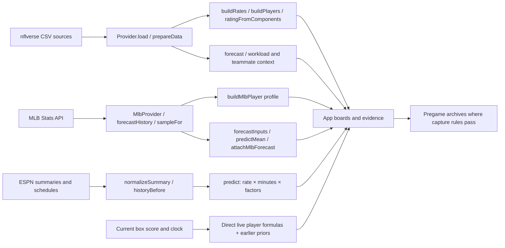

# Standard prediction models: explanation and targeted verification

This review reads the current calculations, original pre-audit source copy, reports, frozen artifacts, cached raw records and saved local predictions. It does not change serving formulas, weights, eligibility, outputs or artifacts. No model was tuned or retrained, no production endpoint or store was queried, and no simulation output was used.

## 1. What the standard models do

There is no single universal prediction number. NFL and MLB have **research profiles** alongside separate **statistical forecasts**. NBA, WNBA, NHL and soccer mostly estimate production per minute, estimate playing time, and apply bounded supporting factors. Direct live player forecasts add expected remaining production to the recorded statistic.

A score of 70/100 means a strong profile under that market's chosen scales. It does not mean a 70% chance of clearing a line. A projected 1.03 hits is a mean, not a possible literal box-score count. A probability is an estimate of an event under a specific error distribution. A debt/gap is a descriptive comparison, not a promise of recovery.

The weighted profiles, fixed rate formulas and live formulas are deterministic arithmetic. MLB's count regression and the saved context corrections actually have fitted coefficients. NFL's team-workload layer also selects a weight using earlier data inside the existing serving path; this review did not run that fitting function. Calling the entire collection “AI” obscures these differences.

**Terms:** A denominator is the population/count below a fraction. Shrinkage blends a small observed sample toward a broader prior by adding specified prior exposure. Calibration means probabilities such as 60% are checked against long-run event frequencies; a probability-looking number or low point error alone does not establish calibration. MAE is mean absolute error in the statistic's units. RMSE is the square root of mean squared error, also in those units; large misses receive more weight.

Supporting evidence:

- [Worked examples, all observations, missingness distributions and field dictionary](C:/Users/eturn/Desktop/nfl-anayltics-app/docs/standard-model-worked-examples.md).
- [Every fitted coefficient, center, scale, context gate and supported market](C:/Users/eturn/Desktop/nfl-anayltics-app/docs/standard-model-formula-appendix.md).
- [Full-precision investigation JSON](C:/Users/eturn/Desktop/nfl-anayltics-app/reports/standard-model-explanation.json).
- [Original file-by-file changes](C:/Users/eturn/Desktop/nfl-anayltics-app/docs/standard-model-change-summary.md) and [previous independent verification](C:/Users/eturn/Desktop/nfl-anayltics-app/docs/standard-model-final-verification.md). The new negative-prior investigation below narrows the previous synthetic-test interpretation; those reports were not rewritten to hide their limitations.

## 2. End-to-end map



All paths below are relative to `C:/Users/eturn/Desktop/nfl-anayltics-app/`; the links use absolute paths.

| Path | Files/functions and transformation | Result, persistence and app location |
|---|---|---|
| NFL profile | `lib/providers.mjs: Provider.load` downloads nflverse schedules, weekly stats/rosters, PBP, snaps, NGS and optional FTN. `lib/source.mjs: bundle/board` → `lib/model.mjs: prepareData` (complete PBP games, player/stat/snaps joins), `buildRates` (previous season), `buildPlayers` (five prior appearances and opponent games) → `lib/rating.mjs: ratingFromComponents` | `modelScore`, `baselineScore`, `opportunityScore`, separate `projected`, `tdProb`, `debt`, components and history. `public/app.js: playerRow/forecastDetail/compareDialog` and evidence panel. `PredictionStore.capture` saves original/adjusted profile alongside forecast. |
| NFL workload | `SourceStore.board` selects up to ten prior appearances → `lib/forecast.mjs: priorSample/project/forecast`; `lib/nfl-workload.mjs: fitTeamWorkload/teamWorkload/workloadDeltas`; `lib/nfl-opportunities.mjs: teammateOpportunities/relevantOpportunity/applyOpportunityRating`; `lib/nfl-context.mjs: nflOpponent`; `lib/context-model.mjs: contextVector/adjustedPoint`; frozen `nfl-context.json` error pools | `forecast.point`, parts, interval, over/under/push, gap, lean and reasons. `lib/predictions.mjs: PredictionStore.capture` → `data-independent/predictions/nfl-predictions/v1/preview/...`; `lib/paper.mjs: capturePaper` → paper archive; production configuration can use private Blob but was not accessed. App forecast strip/details and performance/paper pages. |
| MLB profile | `lib/mlb/provider.mjs: MlbProvider.read/load`, official schedule/roster/person gameLog/box sources; `lib/mlb/source.mjs: loadBundle/candidatesFor`; `lib/mlb/markets.mjs: statValue`; `lib/mlb/model.mjs: sampleFor/buildMlbPlayer/explainAndGrade` | `projected`, capped `modelScore`, observed sample-over rate and profile lean. `public/mlb.js` and shared player research rendering. Research fields coexist with the fitted forecast. |
| MLB fitted forecast | `lib/mlb/forecast.mjs: forecastHistory/attachMlbForecast` → `lib/mlb/forecast-core.mjs: forecastInputs/design/predictMean`; `lib/mlb/context.mjs: mlbOpponent`; shared context correction; `lib/mlb/opportunities.mjs: starterWorkload/mlbOpportunities`; `lib/mlb/matchup.mjs: selectMatchupRows/matchupAdjustment` | `forecast.point`, coefficient terms, interval, probabilities, eligibility/reasons; paper snapshots via `MlbStore.buildBoard`. Evidence endpoint restores terms/gameIds removed from the compact board response. |
| NBA/WNBA/NHL/soccer | `lib/sports/source.mjs: SportsStore.catalog/history/build`; ESPN scoreboard/schedules/summary/roster/injuries cached by `MlbProvider`; `lib/sports/normalize.mjs: gameInfo/normalizeSummary`; `lib/sports/model.mjs: historyBefore/predict/injuryWorkloads`; `lib/sports/opportunities.mjs: roleMinutes/opportunityRate/absenceRate/opposingGoalie/teamMinuteBudgets` | Point estimate, benchmark/posted-line probabilities, interval, sequential contributions and warnings. `SportsStore.capture` → `sports-forecasts/v1/preview/{sport}/{league}/{date}/{game}/{market}/...`, at most one per version/hour when a pregame board is opened. `public/sports.js` cards/rankings/evidence/records; WNBA may rank by projection or line probability, not an NFL-style weighted rating. |
| NFL direct live | `lib/live-nfl.mjs: LiveNflStore.read/history/board`, ESPN live scoreboard/summary and earlier nflverse weekly stats → `normalizeEvent/normalizeSummary` → `lib/live-nfl-model.mjs: buildLivePriors/projectLiveProp` | Recorded/current, remaining and projected total, breakdown and withheld reasons. `public/live.js`. Live source/state lives in memory; no durable live player forecast history was available for this review. |
| NBA/WNBA/MLB direct live | `lib/live-sports.mjs: LiveSportsStore`, `lib/live-feed.mjs: LiveFeed.read`; `lib/live-sports-model.mjs: normalizeLiveBasketball/normalizeLiveMlb`, `basketballPriors/basketballWorkloads/projectBasketball`, `mlbPriors/projectMlb` | Same direct-live output types in `public/live-sports.js`. NHL/soccer do not have this direct-live player branch. Separate controllers can also return game-model data, but these player functions do not consume it. |
| Shared outside inputs | `lib/props.mjs`, `lib/mlb/props.mjs`, `lib/sports/props.mjs`: public ScoresAndOdds lines; `lib/availability.mjs` and sport source injury adapters: availability; `lib/weather.mjs`: venue/roof/Open-Meteo; `lib/pregame-quote.mjs`: freshness | Posted lines are comparisons, never invented from a model mean. Availability can withhold a player or scenario; weather changes only supported active terms. Raw receipts include URL/time/hash/stale state. `server.mjs` connects these stores to the app APIs. |

## 3. Worked examples: actual arithmetic

The [worked-example document](C:/Users/eturn/Desktop/nfl-anayltics-app/docs/standard-model-worked-examples.md) contains every selected game, exact rate/weight terms and full-precision sequential effects. These are the principal reconciliations:

**NFL corrected passing-TD expectation: Josh Allen, LAC at BUF, September 27, 2026.** Five sampled appearances: September 17 and 13, 2026; January 17, 11 and 4, 2026. The last is a verified zero-stat appearance with offensive snaps and stays in the denominator. The sample contains 88 open-field, 24 fringe, 19 red-zone and 3 goal-line modeled attempts. Multiply each by its corresponding 2025 TD/attempt rate: expected sample TDs = 0.507999340260597 + 1.1577488217355143 + 3.412666996536368 + 1.3876404494382024 = 6.466055607970682. Divide by five = 1.2932111215941364, returned as **1.293**. Old targeted-pass rates gave **1.374**. Nine observed passing TDs make current sample debt **−2.534**. No odds/weather/injury adjustment enters this particular `projected` calculation.

**NFL weighted ranking: the same Allen passing-TD profile.** Red-zone attempts per game 4.4 → 4.4/6×100 = 73.3333333333; TDs/game 1.8 → 1.8/3×100 = 60; opponent passing TDs/game 1.4 → 1.4/3×100 = 46.6666666667. Score=.5×73.3333333333+.3×60+.2×46.6666666667 = **64.000/100**. It is not 64% and is unchanged by the expected-TD denominator correction. The worked file also reconciles Saquon Barkley's distinct seven-factor TD profile: **56.40993379043849**, returned **56.410**, before current injury adjustments.

**NFL receptions: Justin Jefferson, MIN at TB, September 27, 2026.** Last five targets 6,9,11,5,8; receptions 3,8,8,4,6. PBP target bins: behind 8, short 17, medium 10, deep 4. Corrected expected totals 6.5526838966202785 + 12.625362234844093 + 5.559691571390588 + 1.4952015355086372 = 26.232939238363597. Divide by five = **5.247**, formerly **5.006**. Debt versus 29 observed receptions becomes **−2.767**, formerly −3.969. Weighted score remains **62.722**.

**NFL workload forecast: Garrett Wilson, NYJ at DET, September 27, 2026.** Actual saved local pregame snapshot September 23 at 02:32 UTC. Last-three targets 17/3; nine-game efficiency 531/73 yards/target. Unadjusted point **41.2192**. Team volume factor capped at 1.2 raises it to **49.4630**; saved injury allocation +0.1061 targets raises it to **50.2348**. Fitted context is disabled, so its shadow +0.012511284 yards contributes zero. Against posted 59.5: over **31.92%**, under **68.08%**, gap −9.2652 yards, interval 11–100, **lean null** because scenario-adjusted probabilities are not separately calibrated. Current `forecast` reproduces saved point and probability exactly using saved inputs; allocation/fit provenance is not independently replayed. [Direct example JSON](C:/Users/eturn/Desktop/nfl-anayltics-app/reports/standard-model-direct-example.json).

**Recent MLB saved forecast: Luke Keaschall, MIN at SF, September 21, 2026.** Sixty earlier appearances, July 8–September 19: 66 hits in 257 PA; recent five 9 hits in 24 PA. Add 40 PA at the fitted prior rate 0.21792674620438116: long rate **0.2515726257514318**, recent rate **0.2768292163777382**. Recent/long workload is 4.8/4.283333333333333 PA; he is away with two days since the previous appearance. Standardizing six features and applying the frozen coefficients gives **1.0312667199141998 hits**. Saved opponent input adds **0.007387707835231741**; temperature 58.8°F subtracts **0.01576311403220443**; wind 9.4 mph subtracts **0.02181780658860882**. Final **1.0010735071286183**, returned **1.001074**, displayed as approximately **1 hit**. Poisson over 0.5 is **63.2515%**. Raw receipt hashes and saved point/probability match. This archive predates the opportunity v2.1 wrapper: the replay verifies its regression/context calculation, not unarchived newer lineup scenarios. [Full recent MLB evidence](C:/Users/eturn/Desktop/nfl-anayltics-app/reports/standard-model-recent-mlb-example.json).

**Additional MLB fitted/profile comparison: Shohei Ohtani, LAD at SEA, September 28, 2025.** This is the latest eligible Ohtani hitting appearance in the fixed evaluation cache, not a claimed current/pregame screen. Sixty earlier games: 65 hits/275 PA; recent five 3/22. With prior rate 0.21792674620438116 and 40 prior PA: long rate **0.23402244396246108**, recent rate **0.18898499755121365**; recent/long workloads 4.4/4.583333333333333 PA. Six standardized features plus intercept sum to log mean **0.028125704489072686**; exponentiation gives **1.0285249665009983**, returned **1.028525 hits**. Historical opponent/weather/lineup/matchup inputs were not supplied, so every supporting change is zero. No posted line or probability/lean is invented. The separate profile is .6×(21/20)+.4×(3/5)=**0.87 hits**, score **54.375**. Full rows and every coefficient term are in the worked file; the outcome 3 hits is excluded from inputs. The MLB card uses two decimal places (1.03); its shared narrative uses one (1).

**WNBA rate/minutes forecast: Kelsey Mitchell, MIN at IND, September 22, 2026 local.** A real local archive contains 560 points/665 minutes in 20 earlier appearances. Positional prior: 5,240 points/10,695 minutes across 496 guard appearances. Prior exposure 166.25 minutes yields **0.7716739253463251 points/minute**. Minutes=.6×33.4+.4×33.25=33.34. Baseline **25.72760867104648** points. Team budget reduces this by **1.3476826590204443**; opponent by **0.726646099812374**; pace by **0.2899546741854664**; venue by **0.13632809181660832**; all other applied effects zero. Final **23.227**, approximately 23.23 in the UI. Poisson over 25.5 **30.90889323889138%**, interval 17–29, no lean. Current point and probabilities exactly match the archive. All historical receipt hashes match; the saved team-budget factor is reused because the entire original candidate roster was not reconstructed. The alternate 0.8242060559817366 shot rate is disabled research output.

**Direct live worked forecast: NOT VERIFIED.** The necessary contemporaneous clock, box score, possession/inning, player status and freshness snapshot is not durably archived. Historical final boxes cannot replace those inputs. The formulas and actual negative historical priors are traceable, but no invented in-game state is presented as a real live prediction.

## 4. Weights, formulas, missing inputs and output meaning

### NFL profile weights

Normalize each input as `100×clamp(input/scale,0,1)`. Windows: five previous completed appearances and up to five previous usable opponent games, bounded by both earlier season/week and earlier date. Current roster/position determines eligibility. Passing markets require QB. Shares use the matching sampled team games, not a separately chosen denominator window.

| Market | Volume (weight .50) / scale | Production (weight .30) / scale | Opponent (weight .20) / scale |
|---|---|---|---|
| pass_yds | attempts/game /40 | pass yards/game /320 | all pass yards allowed/game /300 |
| pass_tds | red-zone attempts/game /6 | pass TD/game /3 | pass TD allowed/game /3 |
| rush_yds | carries/game /25 | rush yards/game /120 | rush yards/carry allowed /6 |
| rec | targets/game /12 | receptions/game /9 | receptions allowed to position/game /18 |
| rush_attempts | player/team carries /.75 | carries/game /25 | carries allowed/game /32 |
| rec_yds | targets/game /12 | receiving yards/game /100 | receiving yards allowed to position/game /150 |
| pass_attempts | player/team attempts /1 | attempts/game /40 | attempts allowed/game /40 |
| pass_completions | attempts/game /40 | completions/game /30 | completions allowed/game /28 |
| pass_interceptions | attempts/game /40 | interceptions/game /1.5 | opposing interceptions/game /1.5 |
| rush_rec_yds | carries+receptions/game /25 | combined yards/game /150 | combined yards allowed to position/game /190 |

TD score uses a different two-group formula:

| Factor | Raw input / normalization scale | Group weight | Full-data final weight |
|---|---|---:|---:|
| Red-zone role | player/team carries+targets inside20 /.5 | role .35 | .21 |
| Volume | carries+receptions per game /25 | role .25 | .15 |
| Goal-line carries | carries inside5/game /2 | role .15 | .09 |
| Target share | player/team targets /.35 | role .15 | .09 |
| TD/touch rate | rush+receiving TD / carries+receptions /.1 | role .10 | .06 |
| Implied team points | (total + team points favored)/2 /35 | context .55 | .22 |
| Position TD allowance | rush+receiving TD allowed to position/game /1.5 | context .45 | .18 |

TD final=.6×role+.4×context. Drought bonus is **zero**. A field may be optional, but at least one role/production factor is required for a score. Within a group, missing factors lose their weight and the remaining weights are divided by their sum. If context is missing, role becomes 100% of the final score. A genuine zero remains present and keeps its weight. Full-data non-TD weights reduce exactly to .50/.30/.20. Negative valid yardage stays negative in raw history, but its normalized positive-profile component bottoms at zero.

The [complete field dictionary](C:/Users/eturn/Desktop/nfl-anayltics-app/docs/standard-model-worked-examples.md) includes every exported definition. Fields outside the market's weighted row do **not** automatically affect its score: efficiency, depth, air volume, end-zone accuracy, sack rate, red-zone pass mix, catch/shallow-target rate, explosive/stuff-avoidance rate, snap share, NGS time/separation, FTN box/coverage splits, drought and expected-minus-actual debt. Snaps/availability can separately affect forecast warnings/scenarios. NGS rushing expectation/debt comes from published tracking values, not these profile weights. FTN/NGS missing coverage is omitted, not invented.

Separate `projected` formulas: any-TD uses zone rush/target rates; passing yards uses depth yards/attempt; pass TD uses zone TD/attempt; receptions uses depth completions/assigned-target; rush yards uses available published NGS expected yards; other markets use their raw sample mean. `tdProb=1−exp(−expected rush/receiving TD per appearance)` is uncalibrated and excludes return TDs. Missing applicable rate makes that expectation unavailable; zero matching opportunities legitimately sum to zero. Debt is historical expected minus recorded production, not target-game error.

### NFL workload and supporting layers

| Input/layer | Formula and fixed weights | Window/bounds | Missing or unsupported behavior |
|---|---|---|---|
| Passing markets | mean attempts × (sum pass yards/TD/INT/completions ÷ sum attempts); attempts market efficiency=1 | workload 3, efficiency≤10, comparison mean 5 | Required fields invalid/missing → forecast unavailable; verified zero rows permitted |
| Receiving markets | mean targets × (sum receiving yards/receptions ÷ sum targets) | same | Same; observed zero opportunity denominator produces zero rate inside `project`, distinct from missing required fields |
| Rushing markets | mean carries × yards/carry; carries efficiency=1 | same | Signed historical yardage permitted |
| Combined yards | rush component + receiving component | same | Both channels required |
| Anytime TD | 1−exp(−[carry workload×rush TD/carry + target workload×receiving TD/target + mean special-team TD]) | same | Separate from profile TD probability |
| Team workload | own recent team mean × clamp((opponent allowed/league mean)^w,.8,1.2); player workload multiplied by projected team/matched recent team volume, capped .8–1.2 | earlier five team/opponent games; w selected from 0,.25,.5,.75,1; chronological 70/30; ≥100 train/≥64 validation, better MAE and MSE to enable opponent weight | Missing input neutral; opponent weight may be disabled while updated team baseline still changes player workload |
| Teammate absence | vacancy allocated by role; supported without-player evidence shrunk by n/(n+8); otherwise half role-share allocation | caps: 50% player increase,4 targets or 8 carries, total vacancy limit; verified team membership/snap/DNP evidence | Stale/unavailable/uncertain QB or role can withhold scenario; when applied suppresses lean pending calibration |
| Fitted context | base + max(1,base)×Σ(coefficient×feature) | opponent relative rate; (outdoor°F−65)/20; wind mph/10; floor .00001; TD cap 1 | Each missing/stale/bad term zero; model's saved enabled gate decides whether terms affect point or are shadow-only |
| Probability/error pool | compare point+historical(actual−predicted) against line; count outcomes rounded/floored0, yards can be negative; TD add-one event smoothing | nearby point ±max(40%,15 yards/2 counts), TD±.15; ≥100 nearby errors and≥5 appearances; empirical 10th–90th interval | Inadequate/calibration-overlap pool → probability/interval unavailable; no line → no line probability |
| Lean | larger of over/under ≥.60 plus all reasons clear | role change≥30%, snap change≥.15, stale/availability/team-change/quote/scenario warnings block | Null lean can coexist with a point/probability; not expected value |

NFL opponent context shrinks five-game production with three league-average games (`lib/nfl-context.mjs`). The [coefficient appendix](C:/Users/eturn/Desktop/nfl-anayltics-app/docs/standard-model-formula-appendix.md) lists all active and disabled market/position context coefficients. No coefficient is silently treated as a hand-selected universal weight.

### MLB profile and fitted forecast

| Input/layer | Formula / weight / units | Window and missing behavior |
|---|---|---|
| Profile | .6×full mean+.4×recent mean; score=clamp(projected/market scale×100,0,100) | hitters 20/recent 5; starters 8/recent 3. Valid earlier completed permitted MLB games; known positive PA/start required. Empty → unavailable. All 16 market fields/scales in appendix. |
| Long production rate | (count+priorRate×priorExposure)/(PA or BF+priorExposure) | same season,last 100 days,max 60 hitter/20 starter; min8/4; prior exposure 40 PA/60 BF |
| Recent rate | same shrinkage formula on last 5 hitters/3 starts | valid count and positive integer exposure required; invalid prior→unavailable |
| Six raw regression features | ln(longRate/priorRate); ln(recentRate/longRate); ln(recentWorkload/priorWorkload); ln(longWorkload/priorWorkload); home 0/1; clamp(restDays,1,14)/7 | standardized by saved centers/scales; intercept + six individually fitted coefficients, all 16 rows in appendix |
| Mean | exp(clamp(intercept+Σβz,−9,ln50)) | frozen 2022 prior/2023 fit/2024 selection; blocked through 2024 development period |
| Context | same three residual features as NFL | All 16 coefficient rows/gates in appendix; unknown/stale terms neutral. `mlbOpponent` uses up to 20 earlier same-season games, minimum five, and 200 prior PA. Pitcher K uses opponent batter K; walks allowed uses batter walks; earned runs uses runs; outs uses batting strikeout rate as a learned proxy. Other markets use their corresponding count. |
| Confirmed order | average slot PA from own and opponent-allowed last 20 team PA distributions; factor expectedPA/recentPA capped .8–1.2 | ≥5 games each; fresh pregame confirmed slot1–9; missing neutral |
| Starter exposure | prior-three BF converted into slot PA, or expectedBF/9; fraction capped 0–1 | ≥4 starts in prior 20; pitch budget is recent 3 pitches×historicalBF/pitch bounded .8–1.2 recentBF; unavailable share→handedness fallback .5 |
| Starter quality | rate=(allowed count+200×staffRate)/(BF+200); 1+starterShare×clamp(rate/staffRate−1,−.2,.2) | hitters HR/hits/walks/batter K only; ≥4 pitcher/≥5 staff games; other markets neutral |
| Pitcher workload | expectedBF/recentBF capped .8–1.2 | own starter history; missing pitch counts neutral |
| Confirmed opposing lineup | mean nine batter rates, each shrunk with 100 PA toward team; ratio to team capped .85–1.15 | pitcher K and walks allowed only; fresh 9 unique batters,≥8 games each; unavailable neutral |
| Hand and head-to-head | relative production difference × PA/(PA+120 or 80), clamp±.15/±.05, multiply starter share, cap full-game±.075/±.025; sum capped±.10 | hand rows up to3 seasons, vs-player selected season rows; historical reconstruction excludes current-season aggregate; missing source neutral |
| Count distribution | Poisson or saved negative-binomial/continuity-corrected normal; probability mass0–200 normalized; 10–90% interval | saved market dispersion; revised scenario probabilities not separately calibrated |
| Lean | profile lean compares point to line with≥3 games; forecast lean requires larger side≥.60 and no reasons | These are different fields. Neither multiplies event probability by payout to compute EV. |

All supporting multipliers are sequential, so the same percentage at different stages has a different absolute change. These scenarios are optional; invalid required history can remove the forecast, whereas missing optional context generally retains a base forecast with warnings. A valid independently supplied totalBases field is not comprehensively cross-checked against every component. Baseball innings are thirds: 6.1=19 outs, not 6.1×3.

### NBA/WNBA/NHL/soccer (same core, explicitly listed exceptions)

All 42 market definitions, component fields and benchmark lines are listed separately in the coefficient appendix: NBA 11, WNBA 15, NHL 7, soccer 9. Combo fields are summed before estimating variance; component probabilities are not multiplied.

| Input/layer | Calculation | Window, bounds, exceptions and missing behavior |
|---|---|---|
| Selected history | complete earlier games within 450 days; last 20 positive-minute valid-count appearances; minimum 5 | source retrieves up to25 earlier games per matchup team; historical actual DNPs are excluded from production sample; invalid counts are unknown, not zero |
| Stabilized rate | (player production+priorMinutes×position-pool rate)/(player minutes+priorMinutes); priorMinutes=5×mean appearance minutes | positional pool comes from fetched history, not league census. Basketball guard/center/forward, NHL defense/attack/goalie, soccer defense/midfield/attack/goalie. Team markets use 90 minutes. |
| Projected minutes | .6×recent 5 mean+.4×full mean | NBA cap 44, WNBA 40, NHL skater32/goalie60, soccer 90; team markets duration |
| Confirmed role | replace minutes with mean of≤10 same-team matching-role games, including explicit bench DNP | ≥3 games; current fresh confirmed role only; unavailable retains base; prevents adding injury minutes twice |
| Injury minutes | blend nonnegative absence-history increase with vacancy×.25×usage/eligibleRoleUsage using n/(n+8) | donors recent 3 games; ≥2 explicit without-player games for evidence; caps2×role allocation,20%own usage,5 min×duration/48 basketball or 2 NHL; none for goalies/soccer |
| Team minutes | factor=min(1,observedTeamBudget/summedPlayerMinutes) | basketball only; ≥5 usable team games,last 10; retains observed overtime budget; never invents unused production |
| Shot conversion replacement | stabilized recent attempt/min × stabilized made/attempt × value, summed; relative cap .75–1.25 | basketball points:2pt/3pt/FT; threes:3 PA; NHL goals:SOG; soccer goals:SOT. ≥5 complete games. Saved market gate must enable; otherwise research-only. NBA/WNBA gates separate. |
| Absence production rate | without-player production stabilized with 8 mean with-player appearances toward current baseline; factor cap .75–1.25 | basketball only; ≥3together/≥2 explicit DNP games. Current confirmed absences; missing neutral |
| Opposing goalkeeper | goals conceded per on-target shot relative to own-team goalies, prior 300shots NHL/50 soccer, cap .8–1.2 | goals/team-goals only; unique confirmed starter,≥5 verified appearances; missing neutral |
| Opponent allowance | (opponent allowed+8×league allowance)/(opponent games+8) divided by league | ≤15 opponent games,≥5 usable, cap .85–1.15. Saves use opponent SOG/SOT; other markets use opponent's opposing team totals |
| Pace | (own recent pace+opponent pace)/2 divided by own pace, cap .92–1.08 | basketball only; pace=FGA+.44FTA−ORB+TO;≥5 each; opponent factor divided by opponent/typical pace and recapped to avoid double adjustment |
| Venue | 1+.25×(shrunk same-venue per-minute rate/overallRate−1), cap .95–1.05 | ≥4 same-venue games,5 mean appearances prior; missing neutral |
| Rest | same quarter-strength rate ratio on short-rest games, cap .95–1.05 | applies only short rest<1.5 days, soccer<3 days;≥3 historical short-rest games; missing neutral |
| Weather | wind≥25mph→.95; temp≥95°F or≤25°F→.97, multiplied | soccer shots/SOT/goals/assists/team goals only; complete valid fresh outdoor weather; unknown/indoor neutral |
| Power-play exposure | 1+.1×(recent 5PPminutes/full PPminutes−1), cap .95–1.05 | NHL shots/goals/assists/points; full PP>.5 min; unavailable neutral |
| Final point | max(.0001,adjustedRate×adjustedMinutes×clamp(product of opponent/pace/venue/rest/weather/PP,.7,1.3)) | rate/role/keeper adjustments happen before this product; current adjustments disabled for stale/non-pregame/validation inputs |
| Count distribution | alpha=clamp((sampleVariance−sampleMean)/sampleMean²,0,2); NB if alpha>0 else Poisson | empirical variance uses 1/n; 10–90% interval; posted line or separate fixed benchmark; all automatic leans disabled |
| Soccer competition | use same competition history if ≥5 relevant games; otherwise mixed sample with warning | no supplied xG, penalty-taker verification or competition-strength coefficient |

Required history/time/count data drives availability; optional factors have explicit neutral fallbacks. Research-only fields include disabled shot candidates, benchmark thresholds, recent-average comparison, sources/coverage, and unsupported features named in warnings. NHL shot-quality xG/confirmed lines, individual defender assignments and basketball tracking chances are not secretly used.

### Direct live player formulas

All return `recorded + remaining opportunities × blended production rate`. They have no trained live probability, confidence interval, EV or automatic bet recommendation.

| Model/input | Formula / coefficient | Window, guard or missing behavior |
|---|---|---|
| NFL historical role | player/team attempts, carries or targets | same-team prior 5 appearances; minimum 3; efficiency up to10; team plays=attempts+carries+sacks overlast5teamgames |
| NFL live role | historical share×(1−w)+observedshare×w; w=min(.7,teamOpp/(teamOpp+20))×min(1,elapsedMinutes/15) | shares0–1; missing team/player opportunities withhold |
| NFL pace | history×[(1−w)+w×clamp(livePace/history,.75,1.25)], w=.35 after5elapsedminutes else0 | prior positive plays required |
| NFL pass/run | blend historical/current dropback share with w=min(.5,plays/(plays+30)); add clamp(deficit/21×elapsedFraction×.12,−.12,.12); passshare cap .25–.9 | scores needed; sackrate and targetrate determine attempts/assignedtargets |
| NFL possession | ±1.5 remaining plays×min(1,secondsLeft/180) | halftime/no possession→0; regulation only,2–60minutesleft |
| NFL production rate | historical×(1−w)+clamp(liveRate,0,2 history)×w; w=min(.2,playerOpp/(playerOpp+40)) | historical builder already floors negative efficiency0; attempts/carries rate1/liveweight0; recorded signed yards retained |
| Basketball minutes | remaining clock×blended role share; liveweight=min(.5,elapsed/duration×.5) | 5 game role,15 same-team production games; scale combined remaining team minutes to≤5×clock |
| Basketball rate | per-component history/live rate blend; w=minutes/(minutes+100), livecap0–2 history | ≥5completeappearances; no overtime/final2 minutes; impossible minutes/counts or status withhold |
| MLB batter workload | remaining regulation team batting outs×1.43 PA/out÷9 slots | still in confirmed batting order; not exact lineup-turn simulation; up to30priorgames,minimum 5 |
| MLB starter workload | min((clamp(last 5pitchmean,40,110)−usedpitches)₊ / pitchesPerBF, outsLeft/outsPerBF) | still pitching confirmedstarter;≤10priorstarts,min3; relievers/removed/extras/delays withheld |
| MLB rate | historical+live blend; livew=PA/(PA+50) orBF/(BF+100), livecap0–2 history | valid integercurrentcount/exposure; outs projection additionally capped by outsleft |

Current missing/stale feeds and reported unavailability suppress live output. A manual pause in the UI is also available. No full-game simulation result enters these formulas.

## 5. Every audit change: before, after and recommendation

These recommendations are judgments, not edits. “Keep” means the implementation correction is supported; it does not establish future accuracy improvement. Fixtures establish guard behavior, while actual replay rows establish measured prediction changes.

| File/change | Old → current behavior; affected output | Evidence and recommendation |
|---|---|---|
| `lib/model.mjs`: passing TD | Target-denominator rate × attempts → attempt-denominator rate × same attempts. Changes `projected`, debt and possibly opportunity flags; not the score weights. | 688 paired rows, 665 lower: **keep** the matched population. |
| `lib/model.mjs`: receptions | Completions/all attempts × targets → completions/assigned targets × targets. | All 5,249 estimates higher: **keep**, despite worse replay error. |
| `lib/model.mjs`: missing rates | Missing applicable rate treated as zero → expectation/debt unavailable. | Guard fixture; clean paired samples unaffected: **keep**. |
| `lib/model.mjs`: scalar/statistic/zone guards | Permissive coercion and bad ratios → finite scalars, positive ratio denominator, zone 0–100, integer counts, valid signed integer yards, verified zero-stat rows. | Invalid inputs can remove a factor or expectation. True zeros remain zeros: **keep**. |
| `lib/model.mjs`: historical boundary | Season/week cutoff alone → season/week plus earlier date; training season must precede target. | Every replayed row passes: **keep**. |
| `lib/model.mjs`: opponent coverage | Missing-stat games counted in allowance denominator → unusable games excluded and disclosed. | Missing coverage can alter allowance/rating; no measured effect on the two clean cohorts: **keep** bookkeeping correction. |
| `lib/rating.mjs` | Embedded/duplicated scoring → shared helper; non-TD missing values formerly acted as zero, now available factors are renormalized. No role factors → null. | Full weights unchanged. Only production=40 changes 15→40; actual volume=0 still gives 15. **Needs more validation** for cross-pattern comparisons; leave current behavior. |
| `lib/nfl-opportunities.mjs` | Duplicate injury scoring with rounded context → shared calculation from exact components; null deltas stay null. | Valid fixture 47.8333→47.8334: **keep**, disclose rounding; do not claim every valid value is unchanged. |
| `lib/forecast.mjs` | Missing/bad dates and required statistics could enter as zero → date exclusion or unavailable point/probability/lean; shared quote/context warnings. | The unchanged `project` passes clean replay across 11 markets, but that is not the full serving wrapper: **keep** guards. |
| `lib/pregame-quote.mjs` | Weak or duplicated checks → finite quote/time, captured-pregame basis, fresh source, age ≤2 hours, no future fetch, both starts future, disagreement <15 minutes. | Can remove lean/archive eligibility without changing point. Displayed probability may remain. Boundary tests pass: **keep**. |
| `lib/context-model.mjs` | Null temperature became 0°F, feature −3.25; bad/stale context could contribute → affected term becomes zero with warning. | Valid features and coefficients unchanged; point changes only if correction enabled: **keep**. |
| `lib/mlb/markets.mjs` | Negative/fractional counts, impossible singles and conflicting outs accepted → invalid/null. | Hits=1,doubles=2: singles 0→null, derived TB 3→null. Outs=19 with 6.2 innings →null; consistent 6.1 remains 19: **keep**. |
| `lib/mlb/model.mjs` | Missing PA, bad date or non-MLB log could enter → known positive PA, valid earlier date and MLB scope. | Can change profile sample, estimate and score; focused tests pass: **keep**. |
| `lib/mlb/forecast-core.mjs` | Bad fitted priors or fractional exposure could enter → positive finite priors, positive integer PA/BF. | Invalid means unavailable/excluded; 16 clean regression markets unchanged: **keep**. |
| `lib/mlb/forecast.mjs` | Stale matchup/workload scenarios could apply → disabled; shared quote and context reasons. | Can change adjusted mean/probability or only lean. Full historical scenarios unavailable: **keep** freshness policy. |
| `lib/sports/normalize.mjs` | Boolean, array and whitespace coercion → strict scalar. | Invalid raw data affected; original evaluator shared normalized history: **keep**, do not overstate ingestion replay coverage. |
| `lib/sports/model.mjs` | Lexical dates, current context in historical/stale paths, invalid counts/workload/weather → timestamp ordering, fresh-pregame gate, validation clears current flags, validated counts and factors. | Can change availability/point/probability under these conditions. Sequential contribution values explain the arithmetic: **keep**. |
| `lib/live-nfl-model.mjs` | Impossible clock or incomplete prior could calculate → withheld for invalid clock/shares/rates. | **Keep** finite/clock guards. Negative-prior guard does not newly suppress the 16 normal built priors; existing zero-floor policy **needs live validation**. |
| `lib/live-sports-model.mjs` | Lexical prior order and impossible minutes/counts/PA/BF/pitches → timestamp order and withholding. | Focused tests pass; live predictive accuracy unverified: **keep**. |
| `lib/source.mjs` | Adds version, stale receipts and schedule kickoff. | A kickoff mismatch can remove a lean; otherwise explanatory metadata: **keep**. |
| `lib/mlb/source.mjs` | Passes the store's clock into forecast. | Consistent freshness time; no standalone point change: **keep**. |
| `lib/mlb/opportunities.mjs` | Version v2→v2.1. | No formula changed: **keep**. |
| `lib/predictions.mjs` | Duplicate quote/kickoff helpers → shared re-exports. | New version capture keys; old archives not rewritten: **keep**. |
| `lib/game-time.mjs` | Extracted conversion; invalid date throws→null. | Valid kickoff conversion preserved: **keep**. |
| `lib/sports/events.mjs` | Extracted raw basketball/MLB adapters. | Same event arithmetic: **keep**. |
| `lib/simulation-source.mjs`, `lib/simulation-props.mjs` audit imports only | Helper imports through model controllers → neutral helper files. | No simulation values used here; no simulation calculation in the audit: **keep** separation. |
| `lib/definitions.mjs`, `public/app.js` audit edits | Correct denominator wording and expose score contributions/coverage. | Display only: **keep**. Separate stale UI wording is identified below, unchanged. |
| Tests and version fixtures | Added audit cases; valid integer opportunity fixtures; version expectations; conflicting MLB outs now null. | No serving effect: **keep**. |
| `scripts/evaluate-standard.mjs`, `standard-metrics.mjs`, package command | Offline comparison across 80 combinations; paired metrics, bins and descriptive intervals. | No training/serving effect: **keep as regression diagnostics**, not untouched validation. |
| Final-verification script/test/edge-case evidence | Independent population/metric/formula-only checks, rounding fixture, synthetic negative prior. | **Keep with limitations**. The real builder trace narrows the synthetic guard interpretation. |
| Reports and example/archive-comparison scripts | File-by-file explanation and local snapshot comparisons. | No serving effect; retain different-time and production limitations. |

Two concrete UI explanation discrepancies were found and left unchanged:

- `public/app.js`, “TD model score”/“Drought signals,” claims +5/+8 drought bonuses. `lib/model.mjs:buildPlayers` sets `due=0`; drought does not add those points.
- `public/research-data.js:forecastSummary` says the NFL TD forecast excludes return TDs. The separate workload `lib/forecast.mjs:project` includes mean `special_teams_tds` in its TD intensity. The profile's `tdProb` excludes returns, but the workload forecast has different scope. The current text merges those meanings.

These are evidenced explanation errors, not requests for an unapproved formula or UI edit. Therefore a universal claim that every displayed explanation matches its formula fails.

## 6. Timing, evidence quality and reproduced results

| Input | Refresh/cache and failure | Publication timing and snapshot evidence |
|---|---|---|
| NFL stats/PBP/rosters/snaps/NGS | Active files checked every 15 minutes, historical files daily; raw bytes plus fetch/check times and hash; failed retrieval retains stale bytes. | Historical files can be corrected. Latest cache is not a version history. Earlier event date does not prove those bytes were published before kickoff. |
| FTN | Optional historical cache. | Delayed postseason charting, research only; cannot establish current pregame coverage. |
| NFL schedule/lines | Same provider cache; tracked game-line file plus public quote receipts. | Historical schedule line may be closing/later information. Original publication timing is not established. |
| MLB stats/history/splits | Default 15-minute cache with caller overrides: completed boxes 6 hours, matchup splits 1 hour. Failed reads retain stale cache. | Completed-event cutoff excludes later games, but corrections/publication delay remain. Aggregate splits ignore requested date ranges; historical reconstruction selects completed seasons. |
| Shared-sport history | Scoreboard/roster/injury 1 minute; team schedule 1 hour; completed summary 24 hours. History bounded to 450 days and up to 25 prior games per matchup team. | Validation suppresses current injury/role information. Reconstructed roster and actual target participation are not frozen pregame knowledge. |
| Weather | `WeatherStore.json` defaults to 15 minutes; venue/geocoding can use a day. Failed or invalid forecast yields unavailable/neutral features. | Corrected historical observation is not the forecast available before the game. Saved forecast inputs are required to establish that. |
| Player lines | Quote fetch time, basis and scheduled start; strict pregame gate ≤2 hours. | Local pregame captures establish receipt before kickoff for those quotes. They do not establish every upstream publication timestamp or closing-line knowledge. |
| Availability/scenarios | NFL reports refresh every minute, with source/check times and stale flags; sport adapters preserve status receipts. | No listing does not prove participation; reports can lag. Final lineups and box participants cannot substitute for pregame announcements. |
| Direct live | Refresh 15 seconds; maximum source age 45 seconds, plus quiet-feed/status guards. | In-memory state here; no durable sequence for historical live player replay. |

The official [nflverse update schedule](https://nflreadr.nflverse.com/articles/nflverse_data_schedule.html) documents later updates and corrections. Polling every 15 minutes does not make upstream publication instantaneous. “The event occurred before kickoff” and “this input was published before kickoff” are separate tests.

The saved local NFL and WNBA examples were timestamped before their upcoming games, allowing replay of their saved model inputs. The 2025 accuracy comparison is a **retrospective reconstruction and regression diagnostic**, using later cached corrected records. It is not an archived pregame replay or untouched holdout.

`node --max-old-space-size=6144 scripts/verify-standard-audit.mjs` was rerun for this review. Both markets cover **2025-09-04 through 2026-02-08**, **285 games**. The measured values are profile `projected`, not the separate `forecast.point`.

| Market | Player-game N / distinct players | Changed | MAE before | MAE after | ΔMAE | RMSE before | RMSE after | ΔRMSE |
|---|---|---|---:|---:|---:|---:|---:|---:|
| Passing TD | 688 / 79 | 665 lower | 0.9082688953488369 | 0.8944680232558146 | −0.013800872093022276 | 1.1443666072050716 | 1.1345322927338006 | −0.009834314471270922 |
| Receptions | 5,249 / 491 | 5,249 higher | 1.2801407887216623 | 1.2948462564297967 | +0.014705467708134412 | 1.7437082187847808 | 1.7543955085170577 | +0.01068728973227695 |

The two sides use identical paired games, players, outcomes and sample histories. No eligibility, missing-rate or cutoff difference explains the observed changes. No sportsbook line enters these metrics. Separate old/new preparation and old code with only the corrected rate tables reproduce the changes: `formulaOnlyMismatch=0`, manual mismatches=0, score changes=0. Missing-outcome exclusions: 418 passing-TD candidates and 727 reception candidates. Outcome availability and actual-participation selection limit relevance to a deployed board.

**Population verification.** The 2024 data has 20,082 pass-attempt flags, 18,505 modeled attempts, 17,748 assigned targets, and 757 receiverless attempts with zero completions. Sacks (1,392), spikes (75), and two-point attempts (110) are excluded. Deleted/no-play rows and ordinary rushes do not qualify; statistical plays with penalties can remain. TD zone numerators 242,356,148,99 now use attempt denominators 540,1980,3597,12388, formerly targets 501,1859,3442,11946. Reception numerators 2667,6604,2114,751 use targets 3192,8827,3666,2063, formerly attempts 3375,9169,3829,2132. Completion and target increments are inside the same target branch. Receiverless is not itself a verified throwaway label. [Official PBP definitions](https://nflfastr.com/reference/fast_scraper.html) include sacks in the attempt flag, explaining the model's explicit sack exclusion.

Lower passing-TD rates happened to reduce error here. Higher reception rates happened to worsen it: the wrong denominator had imposed an accidental downward scaling that helped this inspected sample. Correcting a population definition guarantees neither future improvement nor degradation. No new scaling was fitted to recover the old error.

Approximate equal-game 95% intervals for changes in absolute error:

- Passing TD: mean −0.012290058479532165; interval [−0.019416757524473024, −0.005163359434591306].
- Receptions: mean +0.01503980138253411; interval [+0.011616468016912419, +0.0184631347481558].

Each game receives equal weight here, unlike the player-row-weighted MAE table. Repeated players, teams and time dependence are not fully accounted for. These normal intervals are descriptive, not conclusive significance evidence. No RMSE interval was estimated.

Previously inspected periods include NFL 2025 and postseason; MLB 2025 after 2022 priors/2023 fit/2024 selection; WNBA August 15–October 11, 2025 after earlier development/selection; and the later 30% of available NBA/NHL/soccer cache histories. Repeating these evaluations does not make them untouched. The 80-combination report did not replay every old/new raw adapter or current weather/injury/lineup/quote serving branch. All seven frozen artifacts still match the pre-audit copy, and the reviewed audit scripts perform no tuning. This does not prove an unobservable history of every prior research decision.

**Probability evidence.** NFL workload error pools have retrospective residual and reliability evaluations; active context models use their corresponding saved pools. MLB count distributions have saved chronological probability/error scores. Shared-sport diagnostics include Brier scores and reliability bins, but automatic leans remain disabled. None establishes prospective calibration of every adjusted forecast. NFL ranking scores are not probabilities; the profile's Poisson `tdProb` lacks calibration evidence; direct live outputs are points only.

Neither a 60% lean nor a point-minus-line gap is expected value. EV requires win/loss/push probabilities and net payouts; the standard lean does not combine those. Paper returns settle observed results against odds and do not establish that the prediction method is profitable.

## 7. Missing factors and negative yardage

The documented counterexample reproduces: volume 80, production 0, opponent 0 → score 40. Volume 80 with production/opponent missing →80. Production 40 with volume/context missing →40; true volume 0 with production 40 and context missing →15. Same 0–100 range, different evidence and effective weights.

The census covers **42,382 player-market rows across 253 weekly boards**, all 11 NFL markets over 2025 weeks 1–22 and 2026 week 3. All 23 TD boards mix missingness patterns. The other ten markets have complete components in these records, providing no empirical missing-pattern comparison. Full distributions and ranks for every market are in the worked examples and JSONL evidence.

| TD cohort | Rows | P10 / median / P90 | Mean rank percentile (0 best) |
|---|---:|---|---:|
| 2025 complete | 7,008 | 18.644 / 31.514 / 49.514 | .477605781 |
| 2025 missing TD/touch | 598 | 14.657 / 22.082 / 30.629 | .761423697 |
| 2025 missing RZ share | 4 | 16.209 / 30.429 / 32.604 | .545202409 |
| 2025 missing both | 1 | 17.257 / 17.257 / 17.257 | .926509186 |
| 2026 W3 complete | 433 | 18.182 / 30.849 / 46.603 | .474823816 |
| 2026 W3 missing TD/touch | 32 | 14.343 / 19.457 / 24.800 | .824101395 |
| 2026 W3 missing RZ share | 2 | 13.789 / 13.789 / 13.789 | .765021459 |

These are original `buildPlayers` rankings before current injury allocation, reported-out exclusions and UI filters. They demonstrate within-board mixing, not every actual user view or equal ranking quality. Missing TD/touch often means zero observed touches: its 0/0 rate is unknown even when raw fields are complete. No missing-pattern row reached the top ten here, but role/position/usage confounding prevents an accuracy conclusion. **Comparability remains NOT VERIFIED.** Needed: prospective snapshots with missingness patterns and outcomes, evaluated within comparable participation/position cohorts without tuning on the final test.

**Negative yardage:** 336 negative-rushing-yard weekly rows appear in the loaded 2024–2026 files; 16 current same-team live priors have negative raw historical efficiency. Adonai Mitchell's `2025_15_NYJ_JAX`, play 1566, is a real non-kneel rush: one carry, −4 yards. Nick Mullens has 15 kneels for −11 yards across five prior appearances. Both the pre-audit and current `buildLivePriors` supply **zero efficiency in all 16 cases**. The new guard therefore does not newly withhold these histories through the normal builder. The earlier synthetic test bypassed that builder and established only that directly supplying a negative prior is rejected.

The existing floor changes expected future production from signed history; current recorded negative yards remain recorded. Whether this policy improves prediction remains unresolved. The real historical prior behavior is verified. Actual clock-matched live projection impact and production impact are **NOT VERIFIED**. A durable live box/clock/possession/status/receipt sequence is needed. No guard or floor changed.

## 8. Checklist and exact checks

PASS applies to the narrow evidence stated, not future accuracy.

| Requested check | Status | Evidence |
|---|---|---|
| Every displayed prediction fully traced to original source inputs | **NOT VERIFIED** universally | Main paths and examples traced; full WNBA candidate budget and historical live snapshots missing. |
| Weighted and unweighted fields distinguished | **PASS** in this review | Weight tables, complete field dictionary and disabled candidate examples. |
| Output types correctly explained | **PASS** in this review; current UI has **FAIL** findings | Score/point/probability/benchmark/debt/lean/EV distinctions. Drought and return-TD wording errors documented. |
| Denominators match source populations | **PASS** | `buildRates`, raw bins, independent per-play arithmetic and tests. |
| Missing factors distinguished from zero | **PASS** | `ratingFromComponents` and four explicit examples. |
| Comparability established or marked unresolved | **PASS** disclosure; comparability **NOT VERIFIED** | 253-board census, 23 mixed TD boards and confounders. |
| Negative-yardage behavior established or unresolved | **PASS** for upstream behavior; live impact **NOT VERIFIED** | 16 real priors, old/new zero floor, actual PBP examples. |
| Historical cutoffs exclude future games | **PASS** for replayed paths | Both NFL cohorts have zero non-prior samples; other examples list earlier game IDs; code guards inspected. |
| Publication timing established or unverified | **PASS** disclosure; historical timing **NOT VERIFIED** | Receipt-backed local pregame snapshots are separated from corrected retrospective reconstruction. |
| Metrics reproduce from current data/code | **PASS** | Both `matchesSavedMetrics=true`; six earlier examples match; exact log. |
| Production behavior verified or explicitly unverified | **PASS** disclosure; production **NOT VERIFIED** | Local files and tests only; no deployed request or production archive access. |
| No simulation output used by standard calculations | **PASS** | Recursive import regression plus direct calculation calls; no simulation output loaded for this investigation. |
| No serving/weight/output change in this review | **PASS** | Final check: 55 standard-scope file hashes unchanged; seven frozen artifacts match the pre-audit copy. Four unrelated simulation files changed concurrently after the initial 64-file snapshot; no simulation output was used. See `reports/standard-model-explanation-final-hashes.json`. |

Exact commands, run from the project root:

```text
node --max-old-space-size=6144 scripts/explain-standard-model.mjs
  253 boards / 42,382 rows; 23 mixed-pattern boards; 16 negative priors.
  WNBA saved point reproduced. Serving hashes unchanged.
node scripts/render-standard-explanation.mjs
  NFL direct saved point matches: true; probability matches: true.
node --max-old-space-size=6144 scripts/verify-standard-audit.mjs
  688 passing-TD / 5,249 reception pairs; saved metrics match.
  Different sample / non-prior sample / score / manual / formula-only mismatches: 0.
node --test test/standard-model-audit.test.mjs test/standard-model-verification.test.mjs test/live-nfl.test.mjs test/live-sports.test.mjs test/forecast.test.mjs
  tests 77; pass 77; fail 0; skipped 0
node --test test/mlb.test.mjs test/mlb-forecast.test.mjs test/sports.test.mjs test/wnba.test.mjs test/opportunity-upgrades.test.mjs test/nfl-opportunities.test.mjs test/context-paper.test.mjs test/site-layout.test.mjs
  tests 100; pass 100; fail 0; skipped 0
```

Logs: `reports/standard-model-explanation.log`, `standard-model-explanation-metrics.log`, `standard-model-explanation-tests.log`, `standard-model-explanation-additional-tests.log`. The new analysis script initially stopped while generating its appendix because the NFL artifact names its collection `contextModels`; that analysis-only lookup was corrected, and the entire command then completed. Serving code needed no edit.

The two earlier full-suite failures concerned navigation order and missing `.workspace-switch` markup. The preceding verification logged a complete 336/336 suite. This review reran the relevant `site-layout.test.mjs` tests successfully; it does not claim a new full-suite run. Concurrent or unrelated UI work was left alone.

## 9. Before relying on these numbers

Read the output label first. A profile score, historical expectation, workload mean and line probability answer different questions. Inspect sample size, missingness, availability, stale warnings and exact adjustments. Missing is not zero, and a common score range does not establish equal comparability. A null lean can coexist with a strong-looking probability. Historical replay does not establish pregame publication, production performance, profitability or future accuracy. Keep the correct denominators; treat missing-pattern comparability and the existing live zero-floor policy as unresolved empirical questions. No model behavior changed in this review.
